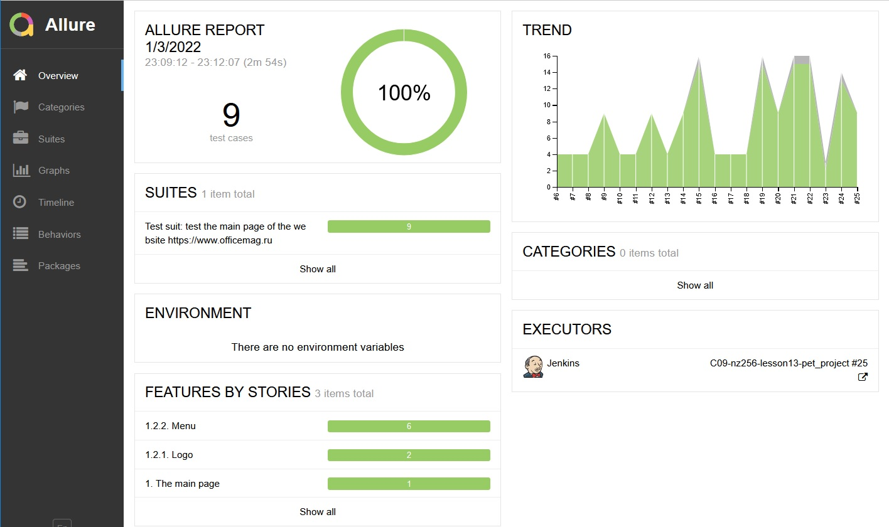
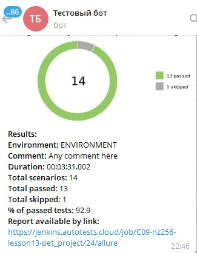
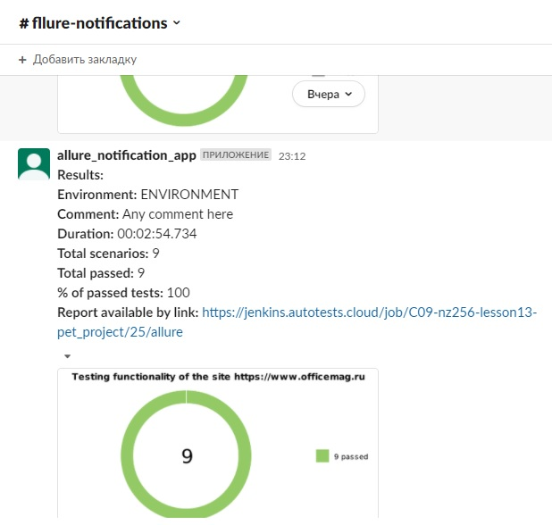
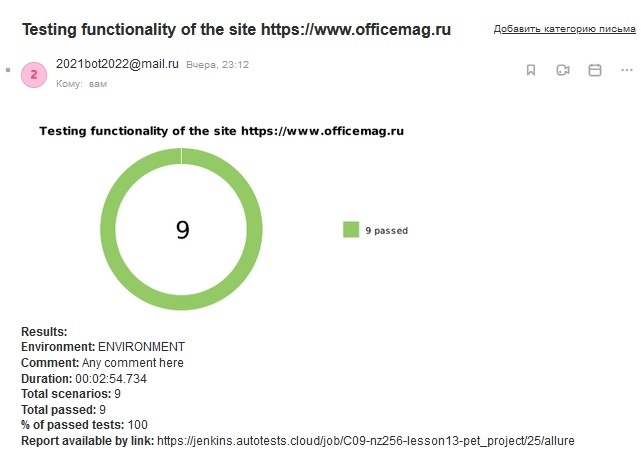
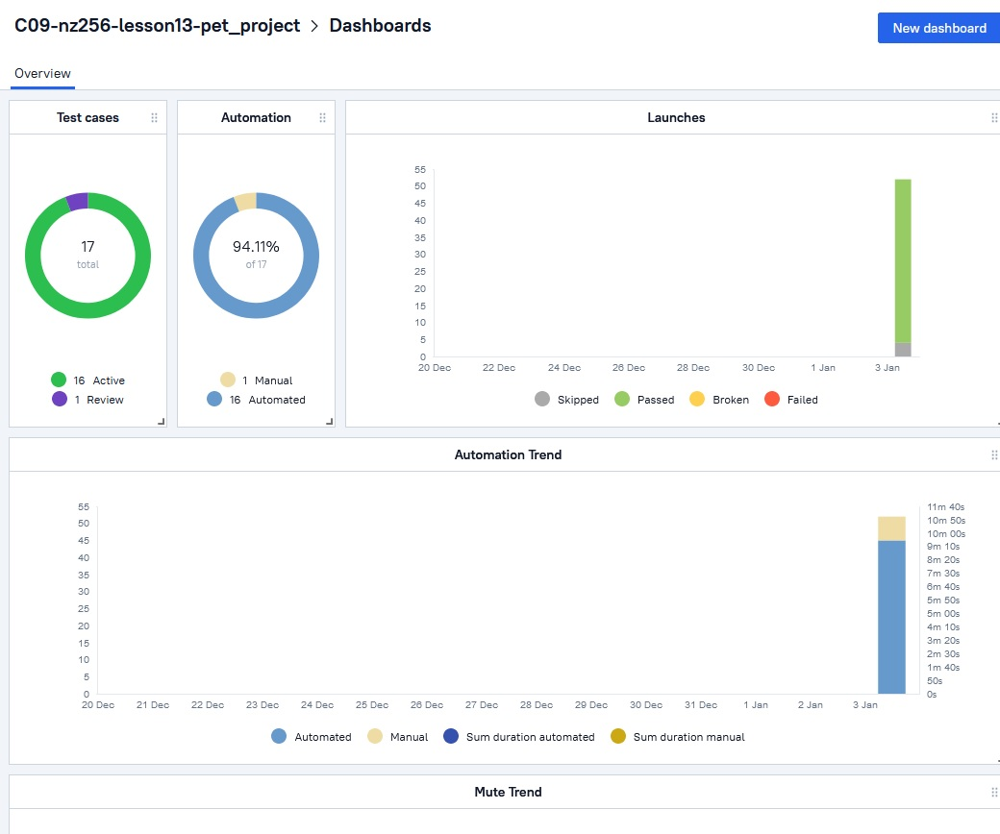
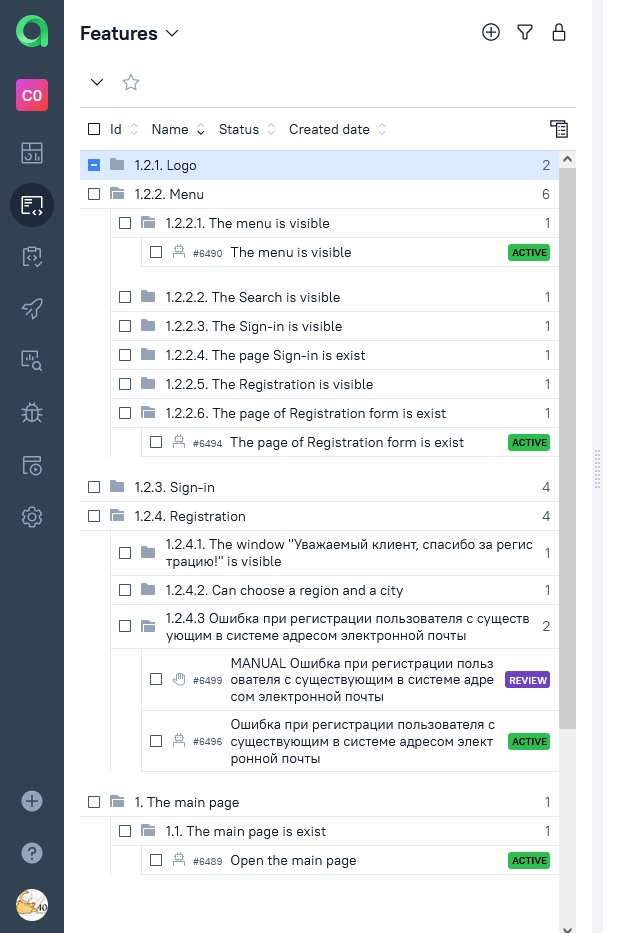
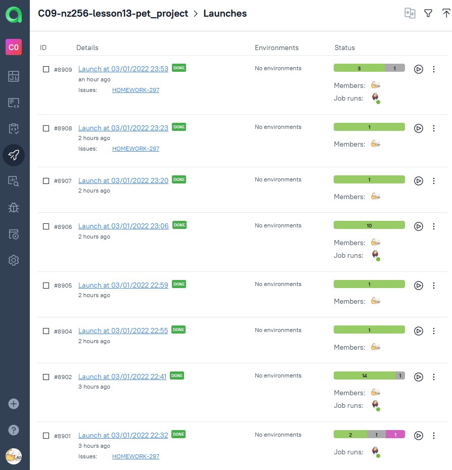
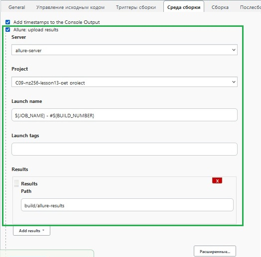
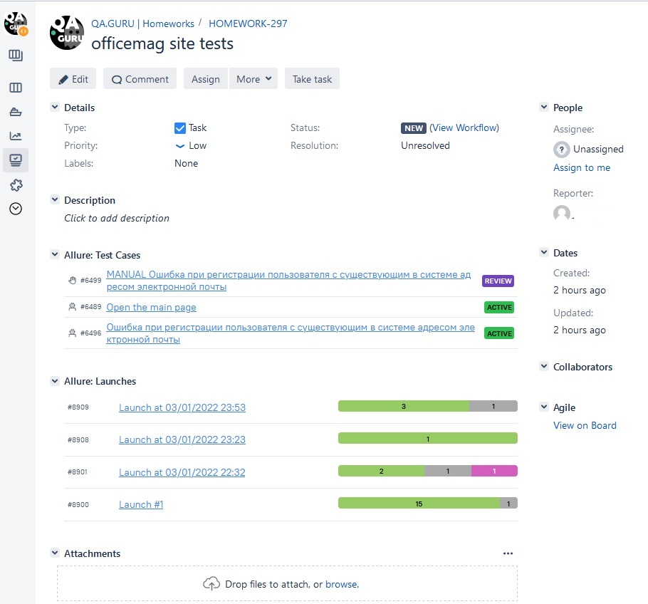

# The Project is consisted some automation tests of site https://www.officemag.ru/
___
It created UI tests by test cases. [See here](src/docs/testdocumentation.xlsx):
* the main page - 9 tests in `class MainPageTests`.
* the Registration form - 2 tests and one "disabled" test in `class RegistrationFormPageTests`.
* the Sign-In form - 4 tests in `class SignInFormTests`.

You can use notifications in telegram, slack or email. 

## USAGE 
You can start tests local and remote.
The properties of the project would be set in:
* system properties
* resources/config/local.properties
* resources/config/remote.properties

*Note: It uses the load strategy "MERGE" (See 1 in Miscellaneous)*

The list of properties are
* browser (default chrome)
* browserVersion (default 89.0)
* browserSize (default 1920x1080)
* browserMobileView (mobile device name, for example iPhone X)
* remoteDriverUrl (url address from selenoid or grid)
* videoStorage (url address where you should get video)
* threads (number of threads)

The data of existed user for tests are in file `src/test/resources/config/users/existuser.properties`.

### For run local tests need fill local.properties or to receive system properties by command line (see 2 Miscellaneous).
1. The quick start. Open a terminal and write

```
./gradlew test
``` 
or       
```
./gradlew test --tests *shouldOpenMainPageTest
```
or
```
./gradlew mainpage
```
*Note: Before you should move to the work directory of the project*.   

2. The start Allure report
```
./build/allure/commandline/bin/allure serve build/allure-results
```


### For run remote tests need fill remote.properties (or local.properties) or to pass value:
Run tests with filled remote.properties:
```bash
gradle clean test
```
Run tests with not filled remote.properties:
```bash
gradle clean -DremoteDriverUrl=https://%s:%s@selenoid.autotests.cloud/wd/hub/ -DvideoStorage=https://selenoid.autotests.cloud/video/ -Dthreads=1 test
```
Serve report:
```bash
allure serve build/allure-results
```
## Notifications
It used `allure-notifications`. [See repo](https://github.com/qa-guru/allure-notifications)

Send notifications by local running tests to `Telegram`:
```
java  "-DprojectName=PROJECT_NAME" "-Denv=ENVIRONMENT" "-DreportLink=BUILD_URL" "-Dcomm=Any comment here" "-Dconfig.file=notifications/telegram.json" -jar notifications/allure-notifications-3.1.2.jar
```
**Telegram notification**




Send notifications by local running tests to `Slack`:
```
java  "-DprojectName=PROJECT_NAME" "-Denv=ENVIRONMENT" "-DreportLink=BUILD_URL" "-Dcomm=Any comment here" "-Dconfig.file=notifications/email.json" -jar notifications/allure-notifications-3.1.2.jar
```
**Slack notification**



Send notifications by local running tests to `email`:
```
java  "-DprojectName=PROJECT_NAME" `
"-Denv=ENVIRONMENT" `
"-DreportLink=BUILD_URL" `
"-Dcomm=Any comment here" `
"-Dconfig.file=notifications/email.json" `
-jar notifications/allure-notifications-3.1.2.jar
```
*Note:* Use the delimiter sign [**`**] in Windows PowerShell.

Fill the file email.json:
```
    "base": {
      "lang": "en",
      "messenger": "email",
      "allureFolder": "build/reports/allure-report/allureReport/",
      "allureLinkPath": "allure",
      "chart": true,
      "chartName": "",
      "project": "Some"
    },
    "mail": {
      "host": "smtp.mail.ru",
      "port": 465,
      "username": "********@mail.ru",
      "password": "*****************",
      "enableSSL": true,
      "from": "********@mail.ru",
      "recipient": "********@mail.ru"
    },
```
**Email notification**  



### Allure TestOps
You can manage tests by Allure TestOps.

| Dashboard |
:-------------------------:|
 |


| Features | 
:-------------------------:|
 | 

| Launches |
:-------------------------:|
 | 

**Note:** Fill setting Jenkins by



## Export issues to Jira


## Miscellaneous
1. The load strategy "MERGE" (docs OWNER):
>All the specified sources will be loaded and merged. If the same property key is specified from more than one source, the one specified first will prevail.
2. Use command line
```
   ./gradlew -D[key]=[value] -D[key1]=[value1] -D[key2]=[value2] test
``` 
3. The example of the Allure report is saw [here](https://clck.ru/aenug)
